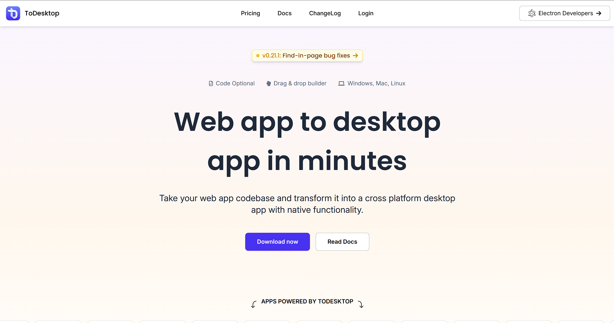
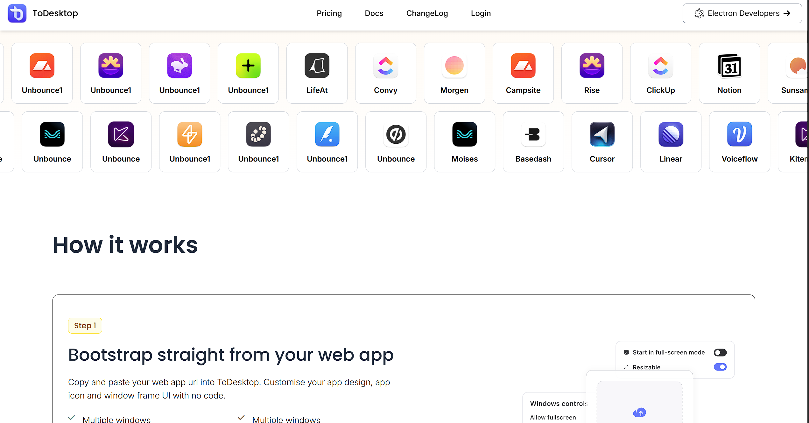
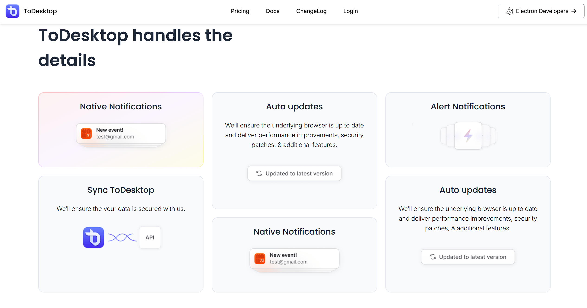

Perfect 👍 — you’ve uploaded three screenshots showing different sections of the **ToDesktop landing page clone** (hero section, apps showcase, and features section).

Here’s a **complete professional documentation (README.md)** you can include in your GitHub repo or portfolio — and it references those screenshots.

---

# 🖥️ ToDesktop Landing Page Clone

A responsive **landing page clone** of the ToDesktop website, built using **HTML, CSS, and JavaScript**. The project replicates the design and layout of the official [ToDesktop](https://www.todesktop.com) homepage, focusing on **modern UI**, **responsive design**, and **component-based layout structuring**.

---

## 📸 Screenshots

### 🏠 Home Section



### 💼 Apps Showcase



### ⚙️ Features Section



---

## 🚀 Project Overview

This project aims to recreate the **ToDesktop homepage UI** to demonstrate front-end design precision and responsiveness using modern web technologies.

The layout includes:

* A hero section with a call-to-action (CTA).
* A showcase of partner app icons.
* A "How It Works" and "Feature Details" section.

It closely follows the real site’s **color palette**, **typography**, and **grid layout**, giving it a professional and realistic appearance.

---

## ✨ Features

* **Pixel-perfect UI clone** of ToDesktop’s website
* **Responsive layout** optimized for desktop, tablet, and mobile
* **Clean and semantic HTML structure**
* **CSS Flexbox & Grid** for layout
* **Reusable components** (nav, buttons, cards, etc.)
* **Hover and transition effects** for modern UX
* **Consistent color and typography system**

---

## 🛠️ Tech Stack

| Technology                      | Purpose                                        |
| ------------------------------- | ---------------------------------------------- |
| **HTML5**                       | Structure and semantics                        |
| **CSS3**                        | Styling, grid/flex layouts, and responsiveness |
| **JavaScript (optional)**       | Navigation interaction and animations          |
| **Responsive Web Design (RWD)** | Mobile-first adaptive layouts                  |
| **Git & GitHub Pages**          | Version control and deployment                 |

---

## 📂 Folder Structure

```
ToDesktop-Clone/
│
├── assets/
│   ├── images/              # Screenshots and icons
│   └── fonts/               # Custom web fonts if used
│
├── css/
│   └── style.css            # Main stylesheet
│
├── js/
│   └── script.js            # Optional JS functionality
│
├── index.html               # Main page
└── README.md                # Documentation
```

---

## 🧭 How to Run Locally

1. Clone the repository

   ```bash
   git clone https://github.com/yourusername/ToDesktop-Clone.git
   ```

2. Navigate to the project directory

   ```bash
   cd ToDesktop-Clone
   ```

3. Open `index.html` in your browser or serve it locally

   ```bash
   # Example using Python
   python3 -m http.server 8000
   ```

4. Open [http://localhost:8000](http://localhost:8000) in your browser.

---

## 🧠 Learning Outcomes

* Improved understanding of **responsive design principles**
* Enhanced **UI replication** and attention to visual detail
* Strengthened skills in **HTML semantics and CSS architecture**
* Hands-on practice with **layout management using Flexbox & Grid**

---

## 📈 Future Enhancements

* Add **mobile navigation menu toggle**
* Implement **animations or scroll effects** using JavaScript
* Add **dark mode** feature
* Integrate **Tailwind CSS** for better utility management

---

## 👤 Author

**Yashu Youwaraj**
🔗 [GitHub Profile](https://github.com/yashuyouwaraj)
🌐 [Live Demo](https://yashuyouwaraj.github.io/ToDesktop-Clone/) *(if deployed)*

---

Would you like me to generate this documentation as a **ready-to-upload `README.md` file** (with proper markdown formatting and embedded image links)?
